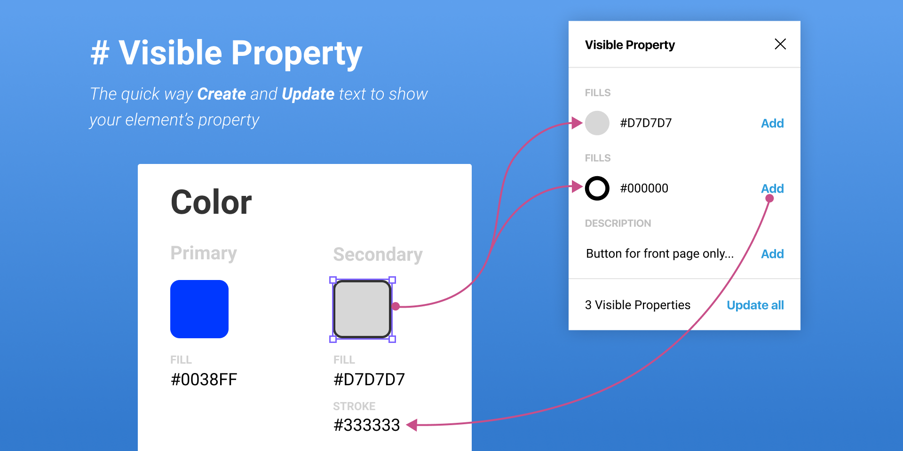

# # Visual Property

It's pain to click on object for just a quick check of color code and more pain when we update it. Visual Property Plugin build to solve this problems.



## How to use this plugin

1. **Select element** you want to create text
2. **Click Visual Property plugin** from Plugin menu
3. **Click Add** to add Color code text under your element
4. You can **edit text** style but not node name
5. You can **Click Update all** to update color code when you change element's color

#### Tip

* plugin can read color from style

## Contribute

0. General setup > https://www.figma.com/plugin-docs/setup/ 

1. Install dependencies

   ```bash
   npm install
   ```

2. Develop 😄
   ```bash
   npm run dev
   ```

### Available commands:

- `npm run dev`: starts the watcher for changes. Modify the files under the `src` folder and the code will be compiled automatically. Then, go to the Figma app and run your development plugin.
- `npm run build`: generates the production build in the `dist` folder. Important: run this command before releaseing a new version of your plugin. Before generating the build, it checks TypeScript, JavaScript and CSS files for linting errors.
- `npm run test`: runs tests via Jest. This script runs before `build`.
- `npm run test:watch`: runs tests via Jest in watch mode.
- `npm run lint`: lint TypeScript and JavaScript files with ESLint and CSS with Stylelint.
- `npm run lint:fix`: lint and apply automatic fixes to TypeScript, JavaScript and CSS files. This script runs before `build`.

## Roadmap

- [ ] Complext element has more than one fills and stroke
- [ ] Enable **Add Description** of component

## Contact

Repository url: https://github.com/apirak/visible-property

Figma design: https://www.figma.com/file/IYX2diPRY4Vir7FzhIB2la/Visual-Property

Made with ♥️ by [Apirak Panatkool](https://twitter.com/apirak) 
